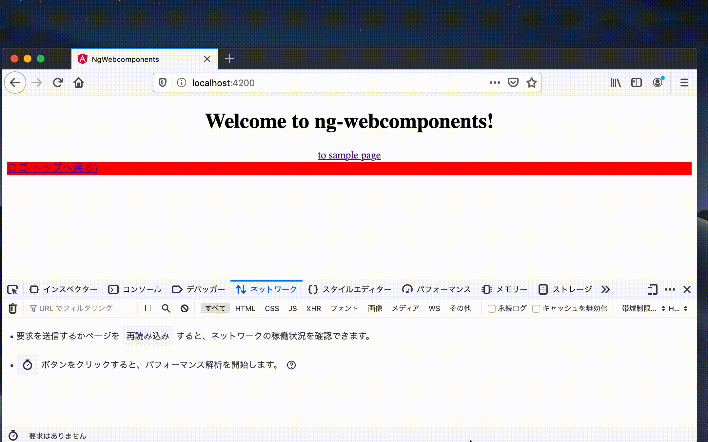
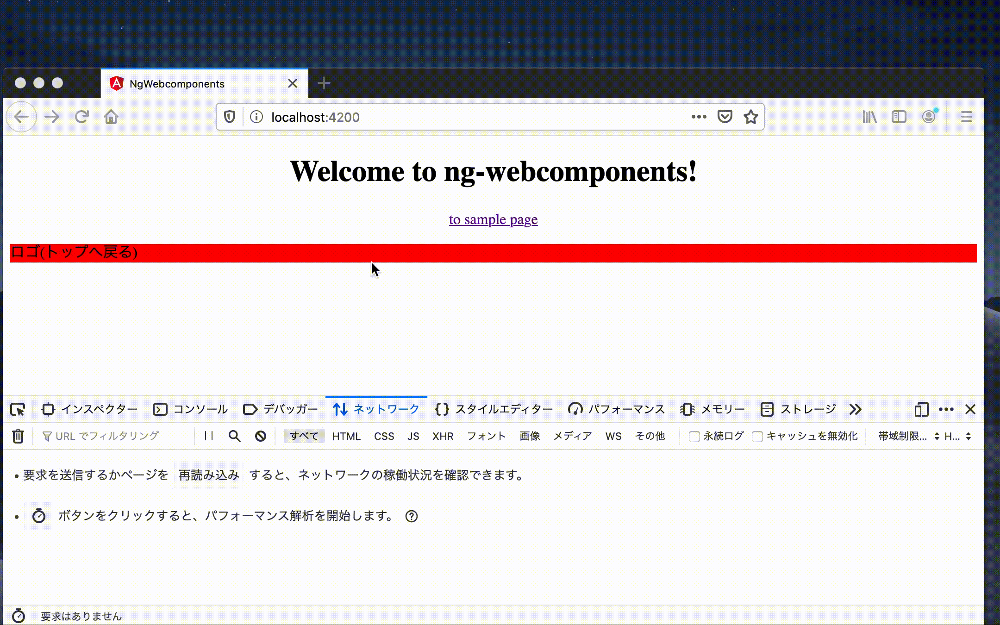

# 概要
このプロジェクトはSPAフレームワーク内で利用されている、webcomponentsからSPA的な遷移をするためのrouterLinkの代替であるappSpaRouterディレクティブのPOC的ななにかです。

## 利用例
Angularで書かれたアプリケーションから`/sample`というパスへ遷移した後、こちらが用意したwebcomponentsのfooterからトップ(`/`)へ戻るというシナリオを考えます。

### a tagを利用すると

のように画面の再ロードをして遷移しますが、

### spaRouterを利用すると

のように再ロードなしに遷移することが出来ます。

## 利用方法

```
// app.module.ts
...
import { SpaRouterlinkDirective } from './spa-routerlink.directive';
...
@NgModule({
  declarations: [
    AppComponent,
    SpaRouterlinkDirective
  ],
  exports: [SpaRouterlinkDirective],
  ....
```

```
// xxx.html
<p appSpaRouter='SPA側のルーターでルーティング定義されているパス'>クリック!</p>
```

と指定するとappSpaRouterプロパティで渡しているパス先に再ロードなく遷移します。

### 注意
基本的に画面遷移にHTML5のpushState, pushStateを利用している場合は利用できると思いますが、Angular以外で動作確認してないです。

### 参考リポジトリ
実際動作可能なリポジトリは、[こちら](https://github.com/takinaga-dev/webcomponentsInAngularSample)を参考にしてください。

